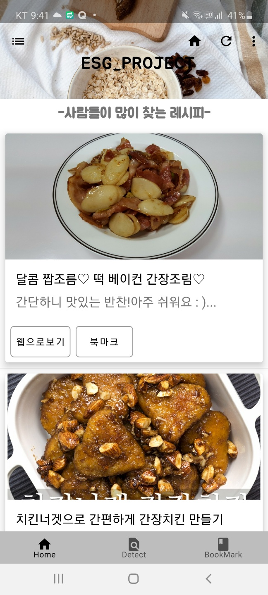
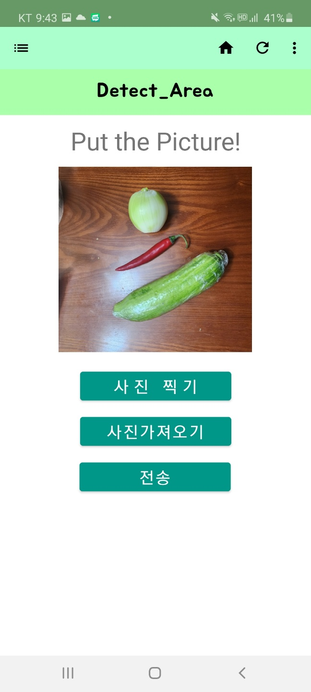
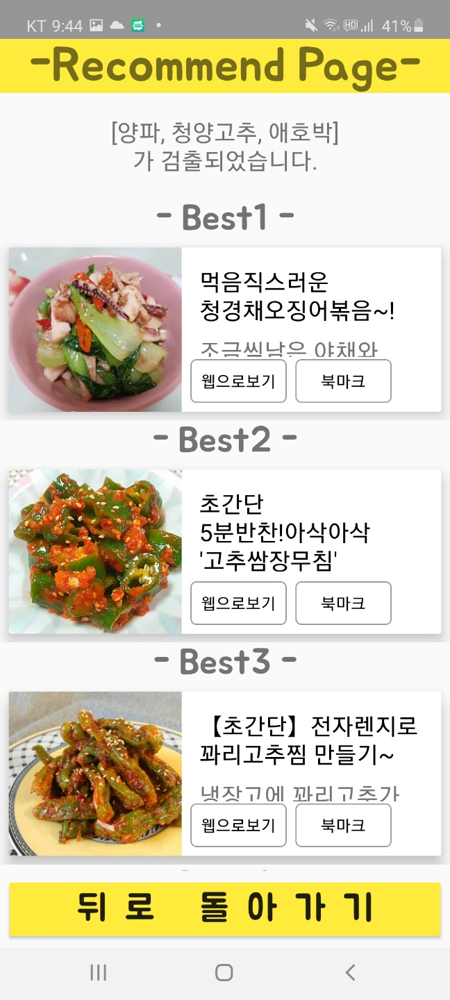

# esg_app
### - 개요
3학년2학기에 세종대 소프트웨어융합대학 ESG(Envirment,Social,Government)주제의 교내학술제에 참가하였습니다.
저희 조는 Envirment를 주제로 재료를 모아놓은 사진을 찍으면 <b>Yolo(v4)</b>인공지능모델을 이용하여 재료를
인식하여 만개의 레시피 사이트에서 가져온 레시피중에서 가장 적합한 레시피 5개를 추천해주는 앱을 만들었습니다.

### - 나의 역할
1. BeautifulSoup,Selenium과 같은 파이썬 라이브러리를 이용하여 레시피를 웹 사이트에서 <b>크롤링</b> 하였습니다.
   - Cron 프로그램을 통하여 레시피 이미지와 관련 정보들을 크롤링 하여, 주기적으로 레시피가 업데이트 될 수 있도록 하였습니다.
3. Kotlin 언어로 <b>안드로이드 앱</b>을 만드는 역할을 수행 하였습니다.
   - Google Firebase의 Realtime database와 Authentication 기능을 활용하여 <b>데이터 저장</b>과 <b>인증</b>을 구현 하였습니다.
4. 인공지능 모델(Yolo v4)를 클라우드 플랫폼을 활용하여 <b>API 서빙</b> 하도록 하였습니다.
   - AWS EC2 서비스와, 파이썬 FastAPI 라이브러리를 이용하여 빠른 서빙을 하도록 하였습니다.
  
### - Achive
개발 경험을 처음 접해 보았었고, 개발의 다양한 부분(UI/UX, 웹 크롤링, 백엔드)을 배워 볼 수 있었고, 이를 통해 IT분야에 대한 흥미를 더욱 키울 수 있었습니다.
  

### - 관련 자료

# 예시 이미지

  
  
  

